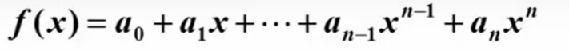

# 数据结构第一周笔记——基本概念(慕课浙大版本--XiaoYu)

> 笔记出处：GitHub地址：[2002XiaoYu (小余) (github.com)](https://github.com/2002XiaoYu)，作者：小余
>
> 笔记持续更新中，有需要的自行获取，提供markdown跟PDF两种格式，在线浏览如果受到不可控影响无法登录GitHub可以查看我掘金账号的专栏对应的文章(目前在陆续上传中)
>
> 如果对你有所帮助，给作者一个star就是最好的鼓励，作者会持续产出的

## 数据结构定义

1. 没有官方的定义，我选取慕课给出的3个定义中最通俗易懂的记录下来

2. 数据结构(data structure)是计算机中存储，组织数据的方式。通常情况下，精心选择的数据结构可以带来最优效率的算法--中文维基百科

   #### 三个例子

   1. 例1：如何在书架上摆放图书
   2. 二分查找：二分查找也称折半查找（Binary Search），它是一种效率较高的查找方法。但是，折半查找要求线性表必须采用[顺序存储结构](https://baike.baidu.com/item/顺序存储结构/1347176)，而且表中元素按关键字有序排列
      1. 首先，假设表中元素是按升序排列，将表中间位置记录的[关键字](https://baike.baidu.com/item/关键字)与查找关键字比较，如果两者相等，则查找成功；否则利用中间位置[记录](https://baike.baidu.com/item/记录/1837758)将表分成前、后两个子表，如果中间位置记录的关键字大于查找关键字，则进一步查找前一子表，否则进一步查找后一子表。重复以上过程，直到找到满足条件的[记录](https://baike.baidu.com/item/记录/1837758)，使查找成功，或直到子表不存在为止，此时查找不成功。

   3. 例2：写程序实现一个函数PrintN，使得传入一个正整数为N的参数后，能顺序打印从1到N的全部正整数

```c
//循环实现
void PrintN ( int N )
{
    int i;
    for( i=1 ;i<=N ;i++){
        printf("%d\n",i);
    }
    return;
}

//递归实现  弊端：递归的程序对空间的占用有的时候是很恐怖的
void PrintN ( int N )
{
	if( N ){
        printN( N - 1 );
        printf("%d\n",N);
    }
    return;
}

//解决问题方法的效率，也跟空间的利用效率有关
```

4. 例3：写程序计算给定多项式在给定点x处的值

   

   ```c
   //直接翻译的结构
   double f( int n, double a[], double x)
   {
       int i;
       double p = a[0];
       for ( i = 0 ; i <= n ; i++ ){
           p += (a[i] * pow(x,i));
       }
       return p;
   }
   //秦久邵的方法
   double f( int n, double a[], double x)
   {
       int i;
       double p = a[n]
           for( i = n ; i > 0 ; i-- ){
               p = a[i-1] + x * p;
           }
       return p;
   }
   ```

   秦久邵的方法公式图

   


clock()：捕捉从程序开始运行到clock()被调用时所耗费的时间。这个时间单位是clock tick,即"时钟打点"

常数CLK_TCK：机器时钟每秒所走的时钟打点数

```c
//这套流程的模板
#include <stdio.h>
#include <time.h>

clock_t start,stop;//clock_t是clock()函数返回的变量类型

double duration;//记录被测函数的运行时间

int main()
{//不在测试范围内的准备工作写在clock()调用之前
    start = clock();//开始计时
    MyFunction();//把被测函数加在这里
    stop = clock();//停止计时
    duration = ((double)(stop - start))/CLK_TCK;//计算时间
    //其他不在测试范围的处理写在后面，例如输出duration的值
    return 0;
}
```


尝试计算这个图中的式子跑了多久

```c
#include<stdio.h>
#include<time.h>
#include<math.h>
clock_t start,stop;
double duration;
#define ,MAXN 10 //多项式最大项数，即多项式阶数+1
double f1(int n , double a[] , double x);
double f2(int n , double a[] , double x);

int main()
{
	int i;
	double a[MAXN];//存储多项式的系数
	for (i = 0; i < MAXN; i++) a[i] = (double)i;
    
    //不在测试范围内的准备工作写在clock()调用之前
    start = clock();//开始计时
    f1(MAXN-1 , a , 1.1);//把被测函数加在这里
    stop = clock();//停止计时
    duration = ((double)(stop - start))/CLK_TCK;//计算时间
    //其他不在测试范围的处理写在后面，例如输出duration的值
    printf("ticks1 = %f\n",(double)(stop-start));
    printf("duration1 = %6.2e\n",duration);
    
    start = clock();//开始计时
    f2(MAXN-1 , a , 1.1);//把被测函数加在这里
    stop = clock();//停止计时
    duration = ((double)(stop - start))/CLK_TCK;//计算时间
    //其他不在测试范围的处理写在后面，例如输出duration的值
    printf("ticks1 = %f\n",(double)(stop-start));
    printf("duration2 = %6.2e\n",duration);
    
    
    return 0;
}

//跑出来结果都是0，因为运行太快了，clock函数捕捉不到它的区别
//解决方案：让被测函数重复运行充分多次，使得测出的总的时钟打点间隔充分长，最后计算被测函数平均每次运行的时间即可
```

以下是解决方案修改后的函数，只截取修改的部分

```c
#define ,MAXK 1e7 //被测函数最大重复调用次数
double f1(int n , double a[] , double x);
double f2(int n , double a[] , double x);

int main()
{
	int i;
	double a[MAXN];//存储多项式的系数
	for (i = 0; i < MAXN; i++)//重复调用函数以获得充分多的时钟打点数 
        f1(MAXN-1,a,1.1);
    stop = clock();
    start = clock();//开始计时
    duration = ((double)(stop - start))/CLK_TCK/MAXK;//计算函数单词运行的时间
    //其他不在测试范围的处理写在后面，例如输出duration的值
    printf("ticks1 = %f\n",(double)(stop-start));
    printf("duration1 = %6.2e\n",duration);
    
    //以下第二个f2保持不变进行对比
    
    start = clock();//开始计时
    f2(MAXN-1 , a , 1.1);//把被测函数加在这里
    stop = clock();//停止计时
    duration = ((double)(stop - start))/CLK_TCK;//计算时间
    //其他不在测试范围的处理写在后面，例如输出duration的值
    printf("ticks1 = %f\n",(double)(stop-start));
    printf("duration2 = %6.2e\n",duration);
    
    
    return 0;
}
```

**解决问题方法的效率，跟算法的巧妙程度有关**


### 什么是数据结构

1. **数据对象**在计算机中的组织方式
   1. 逻辑结构(一对多的逻辑结构有个名字叫做"树")=>树形结构    线性结构(一对一)	图的结构(多对多)
   2. 物理存储结构
   3. 抽象数据类型(Abstract Data Type)
      1. 数据类型
         1. 数据对象集：就是我们说的"是什么东西"
         2. 数据集合相关联的操作集
      2. 抽象：描述数据类型的方法不依赖于具体实现
         1. 与存放数据的机器无关
         2. 与数据存储的物理结构无关
         3. 与实现操作的算法和编程语言都无关只描述
         4. 只描述数据对象集和相关操作集"是什么"，并不涉及"如何做到"的问题
2. 数据对象必定与一系列加在其上的操作相关联
3. 完成这些操作所用的方法就是算法

**例4："矩阵"的抽象数据类型定义**

1. 类型名称：矩阵(Matrix)


 Multiply：乘的意思

a是矩阵元素的值：那要用二维数组去存他还是一维数组又或者是十字链表呢？答案是不用关心，我们需要的只是一个矩阵

Matrix Add(...)：先按行加？先按列加？使用什么语言？  答案是统统不管，这就是"抽象"

## 什么是算法

## 定义

1. 算法(**Algorithm**)

   1. 一个有限指令集
   2. 接受一些输入(有些情况不需要输入)
   3. 一定至少会产生一个输出(否则就没有意义了)
   4. 一定在有限步骤之后终止的，他不像是操作系统只要不关机就可以一直跑在上面
   5. 描述算法的时候不能有无限循环的概念的
   6. 每一条指令必须
      1. 有充分明确的目标，不可以有歧义
      2. 计算机能处理的范围之内(目标不可以太远大)
      3. 描述手段应该"抽象"，不依赖于任何一种计算机语言以及具体的实现手段

   ##### 例1：选择排序算法的伪码描述

```c
void SelectionSort ( int List[], int N)
{
	//将N个整数List[0]...List[N-1]进行非递减排序
	for(i = 0; i < N; i++){
        MinPosition = ScanForMin(List, i, N-1);
        //ist[i]到List[N-1]中找最小元，并将其位置赋给MinPosition;
        Swap(List[i],List[MinPosition]);
        //排序部分的最小元换到有序部分的最后位置;
    }
}
//这不是C语言，虽然他带有C语言的一些特征，但他for循环里面的内容是用自然语言来描述的.上面伪码描述特点：抽象

抽象----
    List到底是数组还是链表(虽然看上去很像数组)? 其实不管是数组还是链表都不会报错
    Swap用函数还是用宏去实现(虽然他看上去很像一个函数)? 但其实用宏写也可以，在我们使用算法的时候是不关心的
```

### 什么是好的算法？

1. 空间复杂度S(n)——根据算法写成的程序在执行时**占用存储单元的长度**。这个长度往往与输入数据的规模有关。空间复杂度过高的算法可能导致使用的内存超限，造成程序非正常中断。
2. 时间复杂度T(n)——根据算法写成的程序在执行时**耗费时间的长度**。这个长度往往也跟输入数据的规模有关。时间复杂度过高的低效算法可能导致我们在有生之年都等不到运行结果。

这个n是我们要处理的内容，这个程序所用的时间与空间都跟这个n是有直接关系的

```c
//递归实现  弊端：递归的程序对空间的占用有的时候是很恐怖的
void PrintN ( int N )
{
	if( N ){
        //假设N=10w，第一步就是10w-1，调用这个函数之前，你的系统需要把当前的这个函数所有的现有的状态都存到系统内存的某一个地方
        //原本是存一下使用后就可以删掉了，使用递归之后在你执行10w-99999之前要把前面所有的运算先执行一遍而不是直接10w-99999，一次性存这么多内容，内存会爆掉的
        //S(N)=C(常数)*N  =>线性增长
        printN( N - 1 );
        printf("%d\n",N);
    }
    return;
}
```

借用上面例3的案例

```c
//计算机算加减比算乘除快很多
//直接翻译的结构
double f( int n, double a[], double x)
{
    int i;
    double p = a[0];
    for ( i = 0 ; i <= n ; i++ ){
        p += (a[i] * pow(x,i));
    }
    return p;
}//这里一共运行了(1+2+...+n)=(n²+n)/2次乘法        时间复杂度：T(n) = C1n² +C2n
//秦久邵的方法
double f( int n, double a[], double x)
{
    int i;
    double p = a[n]
        for( i = n ; i > 0 ; i-- ){
            p = a[i-1] + x * p;
        }
    return p;
}//这里一共就运行了n次乘法        时间复杂度：T(n) = C *n
```


### 复杂度的渐进表示法

“上界（upper bound）是一个与偏序集有关的特殊元素，指的是偏序集中大于或等于它的子集中一切元素的元素。若数集S为实数集R的子集有上界，则显然它有无穷多个上界，而其中最小的一个上界常常具有重要的作用，称它为数集S的上确界。”

太大的上界跟太小的下界对我们分析算法的时候是没有太大的帮助的，尽可能跟它的真实情况贴得越近越好


当我们在取大O的时候，我们一般取的是最小的那个上界。当我们在取Ω的时候通常是写的我们能力范围内找到的最大的那个下界


### 复杂度分析窍门


比如说，如果我们有两段算法，我们知道它们复杂度的上界是什么。如果把两段算法拼在一起的时候，总时间就是两段的和。

那么它们的上界，就是两个上界中间，比较大的那个

当我们把两段算法嵌套起来的时候，两个复杂度要相乘的时候，它的上界就是它们上界的乘积

通过这个我们可以知道如果T(n)是关于n的一个k阶多项式的话，真正起作用的只有最大的那一项 ，其他项都是可以忽略不计的

一个for循环的时间复杂度等于循环次数乘以循环体代码的复杂度，这是一个相乘的关系

if-else ：结构的复杂度取决于if的条件判断复杂度和两个分支部分的复杂度，总体复杂度取决三者中最大 

## 1.3应用实例：最大子列和问题


```c
//这是一个从Ai到Aj连续的一段子列的和
//对N个整数来说，有很多这样的连续的子列，我们要求的是所有连续子列和里面最大的那个，如果这个和是负数的话，我们最后就返回0作为结束
//方法1：暴力破解；方法2：

//以下是暴力破解算法1：
int MaxSubseqSum1( int A[], int N)
{
    int ThisSum,MaxSum = 0;
    int i,j,k;
    for( i = 0 ; i < N ;i++ ){
        //i是子列左端位置
        for( j = i ; j < N; j++ ){
            //j是子列右端位置
            ThisSum = 0;//This是从A[i]到A[j]的子列和
            for( k = i; k <= j ;k++){
                ThisSum += A[k]; //A[i]一直加到A[j]
            }
            if(ThisSum > MaxSum);//如果刚得到的这个子列和更大
            MaxSum = ThisSum;//则更新结果
            
        }//j循环结束
    }//i循环结束
    return MaxSum;
}
//复杂度：T(N) = O(N³)，因为三层嵌套的for循环


//算法2：上面中的k循环其实是没有必要的，属于多余的。我只需要在前面一个j的基础上加一个元素就好了
int MaxSubseqSum1( int A[], int N)
{
    int ThisSum,MaxSum = 0;
    int i,j,k;
    for( i = 0 ; i < N ;i++ ){
        //i是子列左端位置
        ThisSum = 0;//This是从A[i]到A[j]的子列和
        for( j = i ; j < N; j++ ){
            //j是子列右端位置
			ThisSum += A[j];//对于相同的i，不同的j，只要在j-1次循环的基础上累加1项即可  
            if(ThisSum > MaxSum);//如果刚得到的这个子列和更大
            MaxSum = ThisSum;//则更新结果
            
        }//j循环结束
    }//i循环结束
    return MaxSum;
}
//复杂度是：T(N) = O(N²)，因为两层嵌套的for循环

//算法3：分而治之：把一个比较大的复杂问题切分成小块，然后分头解决，最后再把结果合并起来，这就是分而治之
//第一步：先"分"，也就是说把数组从中间一分为二(二分法)，然后递归地去解决左右两边的问题
//递归地去解决左边的问题，我们会得到左边的一个最大子列和，同理得到右边的最大子列和
//特殊情况：跨越边界的最大子列和
//第二步：后"合"找到两个最大子列和和这个跨越边界的最大子列和后，最后的结果一定是这三个数中间最大的那一个

#include <stdio.h>

int Max3( int A, int B, int C )
{ /* 返回3个整数中的最大值 */
    return A > B ? A > C ? A : C : B > C ? B : C;
}

int DivideAndConquer( int List[], int left, int right )
{ /* 分治法求List[left]到List[right]的最大子列和 */
    int MaxLeftSum, MaxRightSum; /* 存放左右子问题的解 */
    int MaxLeftBorderSum, MaxRightBorderSum; /*存放跨分界线的结果*/

    int LeftBorderSum, RightBorderSum;
    int center, i;

    if( left == right )  { /* 递归的终止条件，子列只有1个数字 */
        if( List[left] > 0 )  return List[left];
        else return 0;
    }

    /* 下面是"分"的过程 */
    center = ( left + right ) / 2; /* 找到中分点 */
    /* 递归求得两边子列的最大和 */
    MaxLeftSum = DivideAndConquer( List, left, center );
    MaxRightSum = DivideAndConquer( List, center+1, right );

    /* 下面求跨分界线的最大子列和 */
    MaxLeftBorderSum = 0; LeftBorderSum = 0;
    for( i=center; i>=left; i-- ) { /* 从中线向左扫描 */
        LeftBorderSum += List[i];
        if( LeftBorderSum > MaxLeftBorderSum )
            MaxLeftBorderSum = LeftBorderSum;
    } /* 左边扫描结束 */

    MaxRightBorderSum = 0; RightBorderSum = 0;
    for( i=center+1; i<=right; i++ ) { /* 从中线向右扫描 */
        RightBorderSum += List[i];
        if( RightBorderSum > MaxRightBorderSum )
            MaxRightBorderSum = RightBorderSum;
    } /* 右边扫描结束 */

    /* 下面返回"治"的结果 */
    return Max3( MaxLeftSum, MaxRightSum, MaxLeftBorderSum + MaxRightBorderSum );
}

int MaxSubseqSum3( int List[], int N )
{ /* 保持与前2种算法相同的函数接口 */
    return DivideAndConquer( List, 0, N-1 );
}
int main() {
	int k;
	scanf("%d", &k);
	int a[k] = {0};
	for (int i = 0 ; i < k; i++)
		scanf("%d", &a[i]);
	printf("%d\n", MaxSubseqSum3(a, k));
	return 0;
}
```


当两个复杂度加在一起的时候，我们得到的是比较大的那项，所以我们取O弃N

N/2的k次方=1其实就是2的k次方＝N

每展开一层就多一个cN

不是说4变成了1，而是在求[4，-3，5，-2]这个区间的最大子列和时，要选取[4，-3，5]才能达到最大值

一般地，区间[L，mid]，[mid，R]合并后的最大子列和，等于下面这几种情况的最大值：
1、区间[L，mid]的最大子列和
2、区间[mid，R]的最大子列和
3、区间[L，mid]所有元素的和，加上区间[mid，R]的最大前缀和
4、区间[mid，R]所有元素的和，加上区间[L，mid]的最大后缀和

```c
//算法3---分治法
//以下内容来自教案给出的答案
int Max3( int A, int B, int C )
{ /* 返回3个整数中的最大值 */
    return A > B ? A > C ? A : C : B > C ? B : C;
}

int DivideAndConquer( int List[], int left, int right )
{ /* 分治法求List[left]到List[right]的最大子列和 */
    int MaxLeftSum, MaxRightSum; /* 存放左右子问题的解 */
    int MaxLeftBorderSum, MaxRightBorderSum; /*存放跨分界线的结果*/

    int LeftBorderSum, RightBorderSum;
    int center, i;

    if( left == right )  { /* 递归的终止条件，子列只有1个数字 */
        if( List[left] > 0 )  return List[left];
        else return 0;
    }

    /* 下面是"分"的过程 */
    center = ( left + right ) / 2; /* 找到中分点 */
    /* 递归求得两边子列的最大和 */
    MaxLeftSum = DivideAndConquer( List, left, center );
    MaxRightSum = DivideAndConquer( List, center+1, right );

    /* 下面求跨分界线的最大子列和 */
    MaxLeftBorderSum = 0; LeftBorderSum = 0;
    for( i=center; i>=left; i-- ) { /* 从中线向左扫描 */
        LeftBorderSum += List[i];
        if( LeftBorderSum > MaxLeftBorderSum )
            MaxLeftBorderSum = LeftBorderSum;
    } /* 左边扫描结束 */

    MaxRightBorderSum = 0; RightBorderSum = 0;
    for( i=center+1; i<=right; i++ ) { /* 从中线向右扫描 */
        RightBorderSum += List[i];
        if( RightBorderSum > MaxRightBorderSum )
            MaxRightBorderSum = RightBorderSum;
    } /* 右边扫描结束 */

    /* 下面返回"治"的结果 */
    return Max3( MaxLeftSum, MaxRightSum, MaxLeftBorderSum + MaxRightBorderSum );
}

int MaxSubseqSum3( int List[], int N )
{ /* 保持与前2种算法相同的函数接口 */
    return DivideAndConquer( List, 0, N-1 );
}
```


```c
//算法4：在线处理
//在线处理指的是一组数据。例如[-1,3,-2,4,-6,1,6,-1],我算到第4位数停了下来，返回的数据对于前4位数来说是正确的
//每输入一个数据就进行即时处理，在任何一个地方中止输入，算法都可以正确给出当前的解
int MaxSubseqSum4( int A[],int N )
{
    int ThisSum,MaxSum;
    int i;
    ThisSum = MaxSum = 0;
    for( i = 0; i < N; i++ ){
        ThisSum += A[i];//向右累加
        if( ThisSum > MaxSum)
            MaxSum = ThisSum;//发现更大则更新当前结果
        else if(ThisSum < 0)//如果当前子列和为负
            ThisSum = 0;//则不可能使后面的部分和增大，抛弃之
    }
    return MaxSum;
}
//复杂度：T(N) = O(N) 是线性的
//作为运行效率最高的算法，也是有所副作用的，在这里的副作用是：正确性不是特别明显 


```

