# 数据结构第八周笔记——图(下)(慕课浙大版本--XiaoYu)

> 笔记出处：GitHub地址：[2002XiaoYu (小余) (github.com)](https://github.com/2002XiaoYu)，作者：小余
>
> 笔记持续更新中，有需要的自行获取，提供markdown跟PDF两种格式，在线浏览如果受到不可控影响无法登录GitHub可以查看我掘金账号的专栏对应的文章(目前在陆续上传中)
>
> 如果对你有所帮助，给作者一个star就是最好的鼓励，作者会持续产出的

## 8.1最小 生成 树 问题(Minimum Spanning Tree)

1. 是一棵树
   1. 无回路
   2. 有|V|个顶点的话一定刚好有|V|-1条边(不多不少)
2. 是生成树
   1. 包含了全部的顶点(图全部的顶点都一定要在这棵树里)
   2. |V|-1条边都在原始的图里

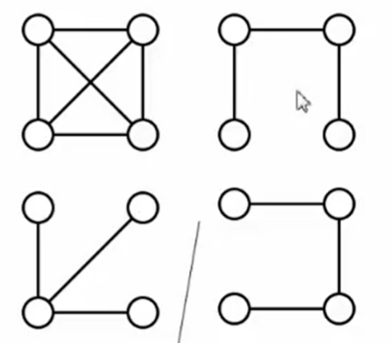向这个生成树中任加一条边都一定构成回路


3. 边的权重和最小(指这个数里面这些边的权重和是最小的)
4. 最小生成树存在的话图一定是连通的，图连通的话那最小生成树也一定是存在的

#### 贪心算法

1. 什么是"贪"：解决问题是一步一步来解决的，每一步都要最好的(眼前最好的)
2. 什么是"好"：权重最小的边
3. 需要约束：
   1. 只能用图里面有的边(原图里面没有的是不能用的)
   2. 只能正好用掉|V|-1条边
   3. 不能有回路

### 8.1.1 Prim算法——让一棵小树长大

树的初始样子：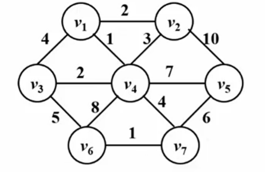 收到一半：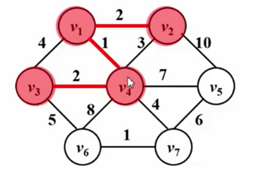

因为为了不直接形成回路，所以接下来不能走v2到v4的那条边,不然就直接结束了 

最后生成的样子为：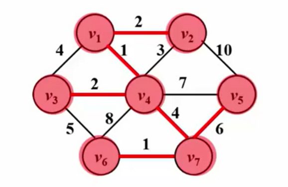

上图的收集算法就是Prim算法，收集的过程有点像Dijkstra算法

回顾**Dijkstra算法**

```c
void Dijkstra(Vertex s)
{
    while(1){
        V = 未收录顶点中dist最小者;
        if( 这样的V不存在 )
            break;
        collected[V] = true;
        for( V 的每个邻接点 W )
            if(collected[W] == false)
                if( dist[V]+E<v,w> < dist[W] ){
                    dist[W] = dist[V] + E<v,w>;
                    path[W] = V;
                }
    }
}
```

**Prim算法**

```c
void Prim()
{
    MST = {s};//跟上方不同的是这里需要先生成一个最小生成树，开始的时候随便选一个根结点s收录进来。这个树怎么存？未必需要真的定义树节点，把树构建出来。可以parent[s] = -1，就是他的父节点的编号，跟并查集里面的概念差不多。这样当我们发现他的parent的
    while(1){
        V = 未收录顶点中dist最小者;//dist在这个最小生成树的问题里被定义成一个顶点v到这棵生成树的最小距离(他跟这个生成树里面已经被收罗进去的顶点之间，所有的距离里面最小的那个，把它定义成是v到这棵树的距离，我们每一次是要从这个距离里面找一个最小的)
        //Prim算法中的dist[V]应该初始化为：E(s,V)或者正无穷
        //E(s,V)：顶点到这个树的距离是这个边的权重
        //如果V跟s之间没有直接的边的话，那我们一定要把它定义成正无穷(跟Dijkstra类似)
        if( 这样的V不存在 )//v不存在就直接跳出来，这时候有两种情况：一种就是全部顶点收录了，如果是这种情况那程序顺利结束
            //第二种情况就是所有未收录的顶点的dist全部都是无穷大，意味着剩下那些顶点到这棵树之间都没有边，整个图是不连通的
            break;
        将V收录进MST:把V收进最小生成树意味着这个顶点到这棵树的距离就变成0了(因为他已经是这棵树的一部分了)
        dist[V] = 0;//设成0就相当于已经收进来了
        for( V的每个邻接点 W )
            if( W未被收录 )//dist不是0就意味着没被收录
                if(E(v,w) < dist[W] ){//v到w之间有一条直接的边，而这个边的距离是小于原始的dist
                    dist[W] = E(v,w);//更新一下这个w的距离。v可能是边直接指向w的
                    parent[W] = V;
                }
    }
    if( MST中收的顶点不到|V|个 )
        Error("生成树不存在 or 图不连通")
}//这一步取决于V= 未收录顶点中dist最小者的做法。粗暴的做法得出来的整个时间复杂度就是T = O(|V|²)，稠密图这样处理好
```

总结：Prim算法对稠密图效果好

### 8.1.2 Kruskal算法(将森林合并成树)

直接了当的贪心(直接找权重最小的边把它收进来)

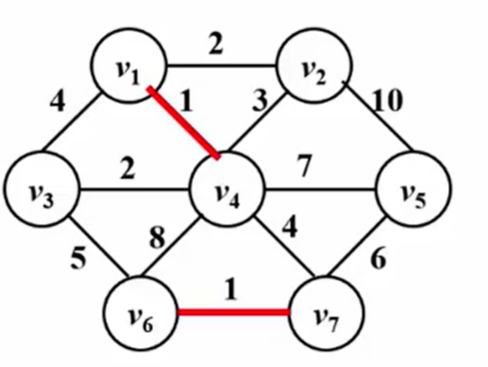

什么叫做把森林合并成树呢？就是在初始的状况下认为每一个顶点都是一颗树，然后通过不断的把边收进来，就把两棵树合并成一棵树了，最后就是把所有的7个节点并成一棵树

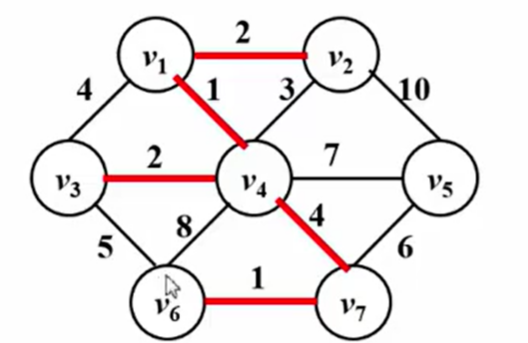边为1收完收2，2收完看3和4和5，3跟部分4和5会形成回路所以跳过

到6的时候形成了最小生成树：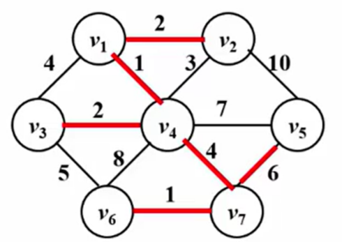 以上就是Kruskal算法的基本思想

**Krustal算法的伪代码**

```c
void Kruskal( Graph G )
{
    MST = { };//刚开始为空集
    while( MST 中不到|V|-1 条边 && E中还有边 ){
        从 E 中取一条权重最小的边E(v,w);//(v,w)是下标，上面用小括号括起来的v,w也都是。时间复杂度取决于这一步(是所有边都搜集一遍还是其他的方法，采用最小堆的方法是最好的)/*最小堆*/
        将 E(v,w)从 E 中删除;//E(v,w)是边集合
        if( E(v,w)不在 MST 中构成回路)//检查这条边加到最小生成树之后是否构成回路/*并查集*/
            将E(v,w)加入MST;//不构成的话边就被加进来了
        else
            彻底无视 E(v,w);
    }
    //while判定的时候不到|v|-1条边就跳出来的情况是：还没收满，原图里面的边就都已经被删光了，没有边了
    if( MST 中不到|V|-1条边 )
        Error("生成树不存在");
}
当图非常稀疏的时候，也就是E跟v差不多同一个数量级的时候
T = O(|E|log|E|)

并查集：一开始认为每个顶点都是独立的一棵树(集合)，当我们把一条边收进去的时候就意味着把两棵树并成一棵
```

#### 并查集

```
信息补充
原理：
初始化
把每个点所在集合初始化为其自身。
通常来说，这个步骤在每次使用该数据结构时只需要执行一次，无论何种实现方式，时间复杂度均为。

查找
查找元素所在的集合，即根节点。

合并
将两个元素所在的集合合并为一个集合。
通常来说，合并之前，应先判断两个元素是否属于同一集合，这可用上面的“查找”操作实现。

```


## 8.2 拓扑排序

### 8.2.1 拓扑排序

例：计算机专业课排课

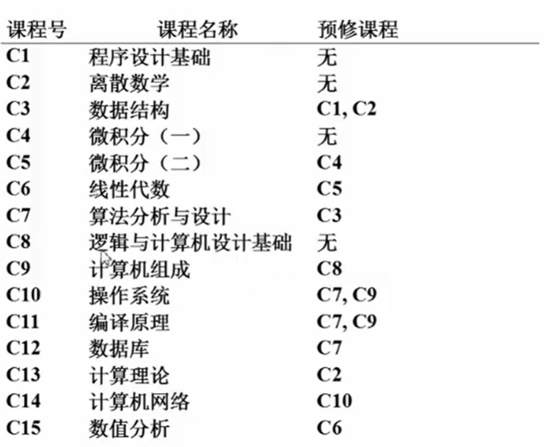

把课程列表转换为图，其中顶点代表课程，则从V到W有一条边代表：**V是W的预修课程**

以下是专业课的依赖图(也叫做**AOV**，是Activity On Vertex的缩写)

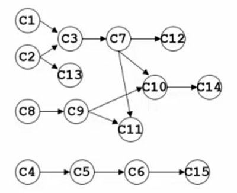

以上抽象成一个**拓扑排序**的问题

1. 拓扑序：如果图中从V到W有一条有向路径，则V一定排在W之前。满足此条件的顶点序列称为一个拓扑序。(意思就是要学习W之前必须要学习V的话，那么在输出的时候V一定要在W之前被输出)
2. 获得一个拓扑序的过程就是拓扑排序
3. AOV如果有合理的拓扑序，则必定是有向无环图(Directed Acyclic Grap,简称DAG)


如图：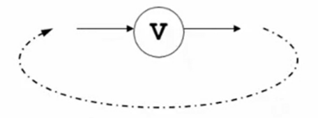什么是合理的拓扑序？有环意味着这个活动他自己是他自己的前驱节点(也就是他在他开始之前就必须要已经结束了)，而V必须在V开始之前结束是不合理的。所以这个是**不行的**，得不到合理的拓扑序

经过排版得出： 规律是：每次我们要输出哪个顶点？输出没有前驱顶点的那个顶点

怎么只是没有前驱顶点？对于顶点来说，我们有两个度可以记得，一个是**入度**一个是**出度**

没有前驱顶点的那些课程的特点：他们的入度都是0，没有任何一条边指向他。

拓扑序步骤：

1. 在输出的时候我们要选择入度为0的那个顶点
2. 在输出的同时我们要把这个顶点从原始的图里面彻底抹掉，当我们把原来的图抹光的时候，一个正常的拓扑序就产生了

#### 拓扑排序的算法

```c
void TopSort()
{
    for( cnt = 0; cnt < |V|; cnt++ ){
        //在TopSort函数中，如果外循环还没结束，就已经找不到“未输出的入度为0的顶点”，则说明：图中必定存在回路
        V = 未输出的入度为0的顶点;//程序复杂度的复杂程度主要取决于这一步。
        //方法1：简单粗暴的把所有点都扫描一遍然后去找那个没有输出过的且入度又为0的顶点，复杂度就为O(|V|)。
        //整体复杂度：T = O(|V|²)	这是不聪明的做法
        //方法2(聪明的算法)：随时将入度变为0的顶点放到一个容器(可以理解为任何东西，数组、链表、堆栈、队列之类里都可以，总之放到一个特殊的地方)里面。这样就不用重新去扫描所有的顶点集合，直接从容器里面取一个出来就行了，这样复杂度就直接变成常数级别的了
        if( 这样的V不存在 ){
            Error("图中有回路");
            break;
        }
        输出V，或者记录V的输出序号;
        for( V 的每个邻接点 W )
            Indegree[W]--;//意味着把V到W的这条边给减掉了,W少了一条进来的边，所以入度就会减少1。就是把V抹掉的意思(抹掉不是删掉)
    }
}
```

#### 聪明的算法

方法2(聪明的算法)：随时将入度变为0的顶点放到一个容器(以下是用队列做排序)

```c
void TopSort()
{
    for ( 图中每个顶点 V )
        if( Indegree[V]==0)//检查有没有入度为0的
            Enqueue( V,Q );//有的都放到容器里面
    while(!IsEmpty(Q)){
        V = Dequeue( Q );
        输出V,或者记录V的输出序号;cnt++//输出后就需要抹掉，就通过下面那个for循环解决，入度减一
        for( V 的每个邻接点 W)
            if( --Indegree[W]==0)//剪完入度为0就放入下面那个容器里面，下次可以取出来用，否则就说明都不做，继续去容器里取下一个顶点
                Enqueue( W,Q );
    }
    if( cnt !=|V|)//检查顶点有没有输出完，没有输出完就意味着遇到回路了
        Error("图中有回路");
}

此时时间复杂度为：T = Q(|V|+|E|)
    如果是稀疏图的话是QV的复杂度，稠密图的话|V|²数量级的
```

### 8.2.2 关键路径

**AOE**(Activity On Edge)网络

1. 一般用于安排项目的工序

```
Earliest：所有的任务最早的完成时间
Latest：所有任务最晚完成时间
```

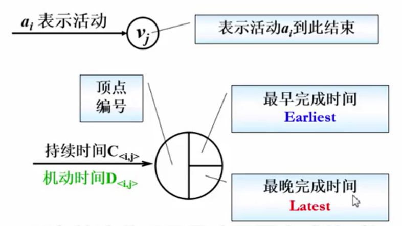

------------------

```
0顶点表示开始，8顶点表示结束
每一条边代表一件事情
每件事情按照相互依赖的顺序完成了之后到达顶点8为结束
边上的权重代表持续时间
边之间的关系：两个小组之间开工就必须两个小组都完工才能往下走

假设不仅得1、2组结束，同时还需要等3一起全部完工才能往下走
```

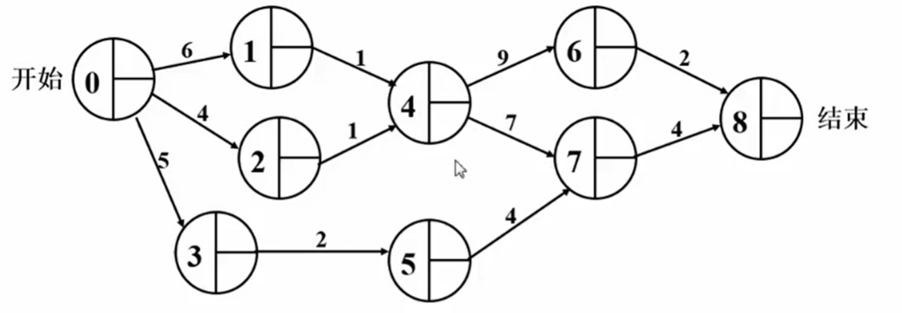

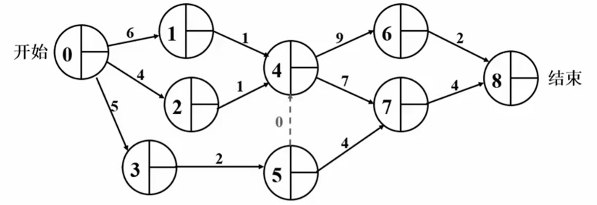

问题1：整个工期有多长  

问题2：哪几个组有机动时间？(就是可以随时拉出去干活的，不需要赶工的)

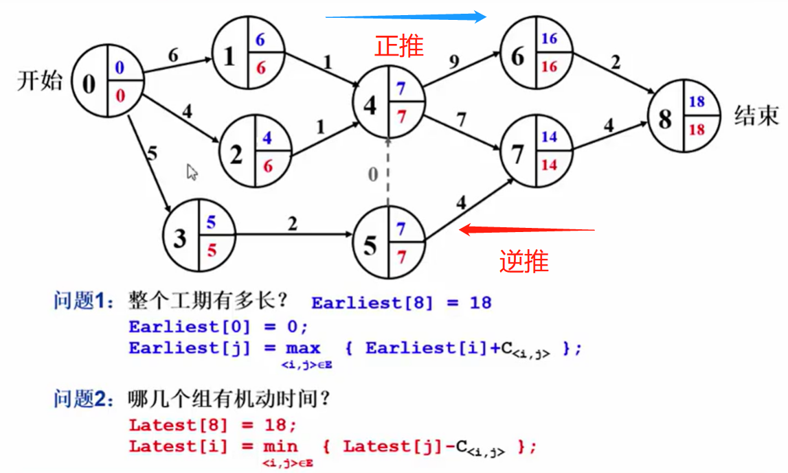

绿色部分为机动时间：

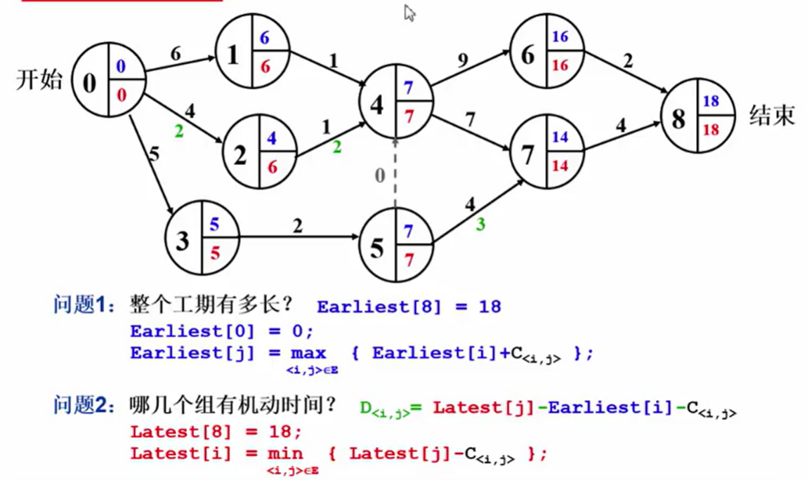

什么是关键路径：整个manager最需要关注的那些组，哪些组是一天都不能耽误的(耽误一条整个工期都得往后耽误)。所以关键路径就是指**绝对不允许延误**的活动组成的路径

## 图之习题选讲-旅游规划

### 图习题.1 核心算法

#### 题意理解

1. 城市为结点
2. 公路为边
   1. 权重1：距离
   2. 权重2：收费 

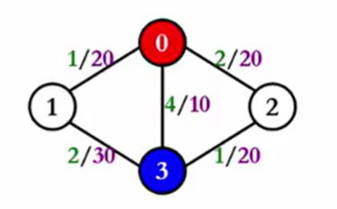红色是起点，蓝色是终点。；绿色字体是距离，紫色字体是收费

3. 单源最短路
   1. Dijkstra算法 ——距离 (一个结点一个结点往那个集合里面去收集，每收进来一个就要检查以下其他结点距离有没有被新进来的结点影响，得到更短的距离就刷新掉，得不到就保持原样)
   2. 等距离时按收费更新

**核心算法**

```c
最基础版本的Dijkstra算法
void Dijkstra( Vertex s )
{
    while(1){
        V = 未收录顶点中dist最小者;
        if( 这样的V不存在 )
            break;
        collected[V] = true;
        for( V 的每个邻接点 W )
            if( dist[V] + E<v,w> < dist[W] ){//Vd点的加入使我们得到一个更短的w的距离
                dist[W] = dist[V] + E<v,w>;//更新距离
                path[W] = V;//更新最短路径
            }
    }
}
```

```c
根据基础进行改良过后的
最基础版本的Dijkstra算法
void Dijkstra( Vertex s )
{
    while(1){
        V = 未收录顶点中dist最小者;
        if( 这样的V不存在 )
            break;
        collected[V] = true;
        for( V 的每个邻接点 W )
            if( dist[V] + E<v,w> < dist[W] ){//Vd点的加入使我们得到一个更短的w的距离
                dist[W] = dist[V] + E<v,w>;//更新距离
                path[W] = V;//更新最短路径，s走到V的所有费用加上V走到W这条边的费用
            }
        else if((dist[V]+E<v,w> == dist[W]) && (cost[V] + C<v,w> < cost[W])){//等长最短路径并且这条路径上面的新费用比原来的费用小的话那也要更新路径
            cost[W] = cost[V] + C<v,w>;//更新费用
            path[w] = V;//更新路径
        }
    }
}
```


### 图习题.2 其他推广

#### 其他类似问题

1. 要求最短路径有多少条?
   1. count[s] = 1;//计数器的作用
   2. 在要求数最短路径有多少条的问题中，如果找到更短路，则count[W]应该更新为要求边数最少的最短路：count[W]=count[V]
   3. 在要求数最短路径有多少条的问题中，如果找到等长路，则count[W]应该更新为：count[W]+=count[V]
2. 要求边数最少的最短路
   1. 费用初始化怎么做？初始化为0
   2. count[s] = 0;
   3. 如果找到更短路：count[W]  = count[V] + 1;
   4. 如果找到等长路：count[W] = count[V] + 1;//count[V]加上新的权重